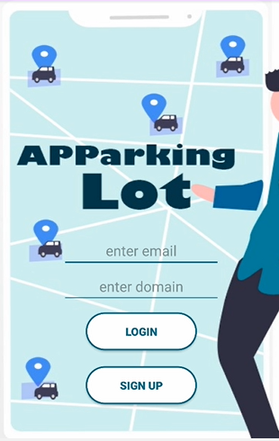
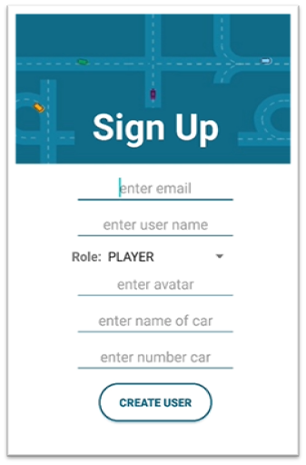
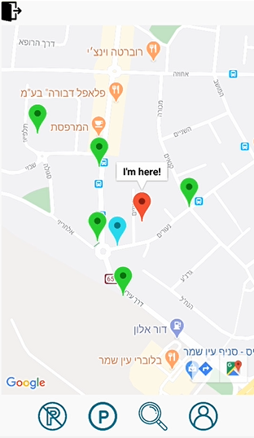

# APParking Lot

## Description
APParking Lot is a social application that allows users to share data about parking spaces. The vision of the system is making parking spots easier to locate and to shorten the searching time.

Retrofit and Google Maps API are used.

## Actions in APParkingLot

Player Actions: 

<table>
    <th>Action</th>
    <th>Description</th>
		<tr>
			<td><b>Sign Up</b></td>
			<td>User registration for the application</td>
		</tr>
		<tr>
			<td><b>Login</b></td>
			<td>User login to the application</td>
		</tr>
		<tr>
			<td><b><b>Search parking</b></b></td>
			<td>Search parking and parking-lots availables in the user's current area by a predetermined range. 
				Parking - green marking. 
				Parking lot - blue marking.</td>
		</tr>
		<tr>
			<td><b>Parking</b></td>
			<td>Park your car in your current location.</td>
		</tr>
		<tr>
			<td><b>Release parking</b></td>
			<td>Release the parking you have seized.</td>
		</tr>
		<tr>
			<td><b>Update details</b></td>
			<td>Update personal information of the user.</td>
		</tr>
</table>

Manager Actions:  
*Adding car parks. 
*update personal details. 
*Search for cars of users, parkings, parking lots. 

## Screenshots

  
  
  

